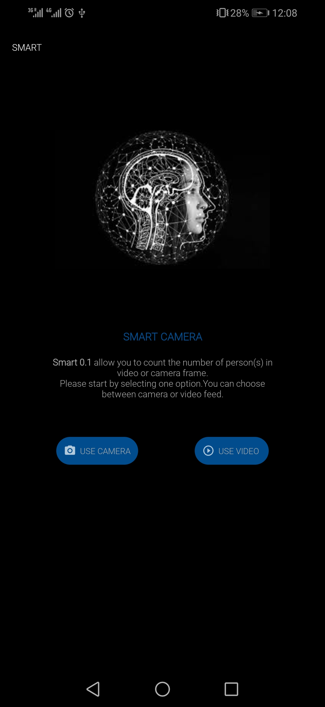
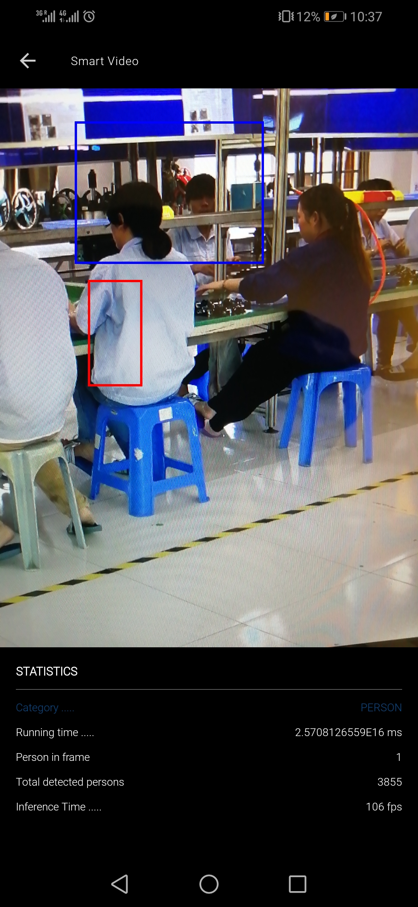

# People Counter
## Overview  

In this app, we use `Tensorflow Object Detection`  for **android** than you can find in [Tensorflow lite documentation](https://www.tensorflow.org/lite/models/object_detection/overview).
This  app continuously detects the objects in the frames(Camera Picture capture or Camera Video) seen by your device's back camera, using a quantized [MobileNet SSD model](https://github.com/tensorflow/models/tree/master/research/object_detection) trained on the [COCO](http://cocodataset.org/) dataset.

## Demo
Here are some screens of the final application.
-  Menu option selection

- Detection and people counting

 
